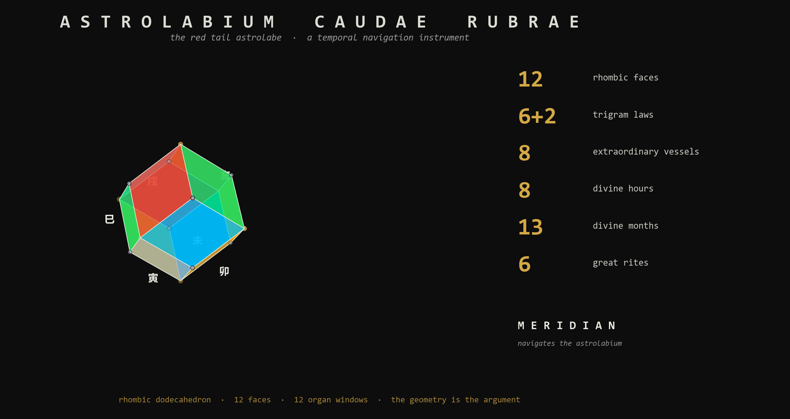
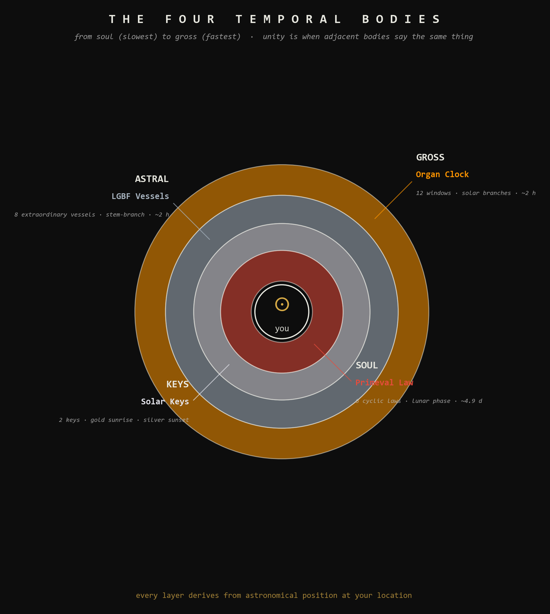
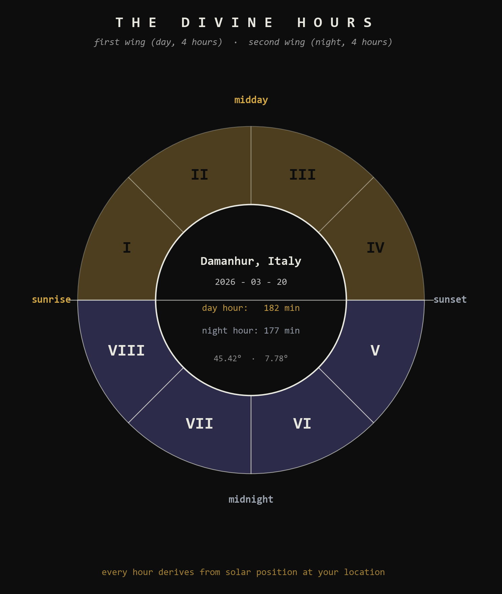
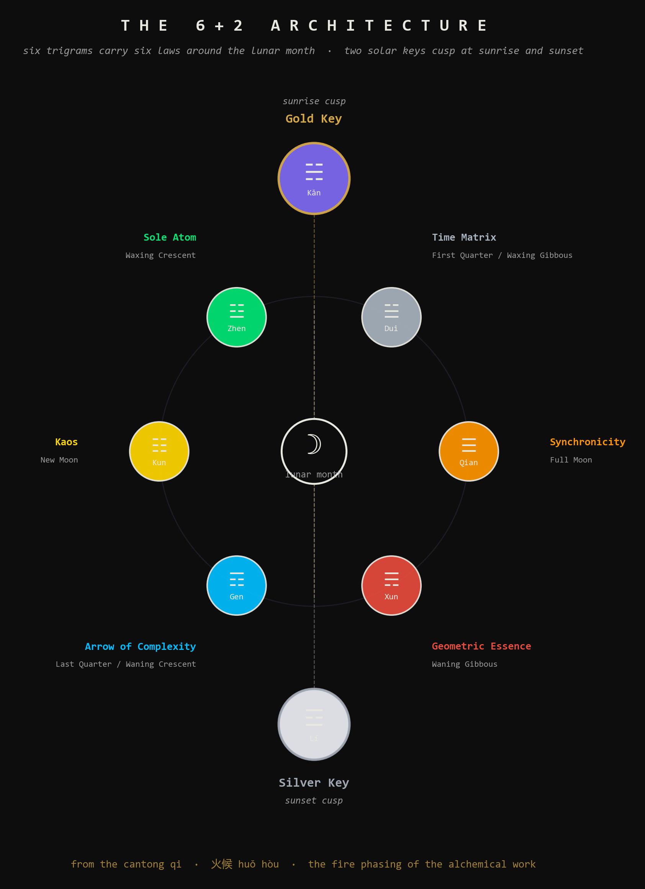

[](astrolabium/tests/)
[](astrolabium/pyproject.toml)
[](LICENSE)
[](https://github.com/tasumermaf)

# Meridian — the Astrolabium harness

> *What is the alchemical quality of this moment?*

A working temporal navigation instrument plus the research intelligence
that runs it. Six ancient systems synthesized into one readable display
— integrated, regression-tested, and configured with all the context
needed to explain itself to anyone who asks.

This is the public **Claude Code harness** for the **Astrolabium Caudae
Rubrae** (*L'Astrolabio Coda Rossa*, the Red Tail Astrolabe).

## The numbers

| Component                                  | Count |
|--------------------------------------------|-------|
| Rhombic dodecahedron faces                 | 12    |
| Trigram laws (6 cyclic + 2 solar keys)     | 6 + 2 |
| Extraordinary vessels (LGBF)               | 8     |
| Divine hours (4 day, 4 night)              | 8     |
| Divine months (12 regular + 1 intercalary) | 13    |
| Great rites                                | 6     |
| Earthly branches (organ-clock windows)     | 12    |
| Engine tests passing                       | **608** |

The geometry is the argument. Every count above lands on a rhombic
dodecahedron face count, an LGBF vessel count, or the unequal-hour
division of solar position at a specific location. See `docs/specs/`
for the full Operator's Manual, Guidebook, and Periodic Table.

## What the instrument answers

One question: **what is the alchemical quality of this moment?**

That breaks operationally into: which Primeval Law is active in the
**Soul body** right now (lunar phase), which Extraordinary Vessel is
open in the **Astral body** right now (Ling Gui Ba Fa), which organ
window is active in the **Gross body** right now (Organ Clock), which
Divine Hour we're in, whether a Solar Key is cusping, which Divine
Month this is, and whether any of those layers happen to be saying
the same thing at the same time (compound detection).

It does not warn, prohibit, or prescribe. It does not tell you a moment
is good or bad. The practitioner is assumed competent. The instrument
displays what is available.



## The non-negotiable constraint

**Every hourly function requires location.** Latitude, longitude, and
timezone. There is **no civil clock** anywhere in this system.

Two practitioners in the same Gregorian time zone but at different
latitudes get different Astrolabium readings, because their solar
horizons differ. This is correct and load-bearing. The instrument reads
from your actual sunrise and sunset, not from Greenwich. Without
location, no reading is possible.

When you talk to the resident Meridian intelligence in this harness, it
will ask for your coordinates if you have not provided them. This is
not pedantry; it is the system.



> *The image above shows the Divine Hours wheel for Damanhur, Italy
> on the spring equinox (2026-03-20), computed live from the project's
> own solar engine — 182 minute day hour, 177 minute night hour.
> Eat your own cooking.*

## The 6+2 architecture

Three independent traditions converge on the same split: the *Cantong
qi* (Daoist alchemy) excludes Kǎn ☵ and Lí ☲ from the lunar cycle and
treats them as the alchemical operators; the **Plum Blossom Fist Form**
avoids the Water positions when traversing the Posterior Heaven Bagua;
the *Book of Three Responses* identifies Water as the medium of the
mirror-transit, not a phase of it.

Six trigrams carry six cyclic **Primeval Laws** through the lunar
month. Two trigrams sit outside the cycle as **Solar Keys**, activating
at sunrise (Gold Key, Kǎn ☵, Fall of Events) and sunset (Silver Key, Lí
☲, Divinity). The two cusps are the daily moments when the alchemical
fire is most precisely controllable.



## Quick start

```bash
git clone https://github.com/tasumermaf/meridian.git
cd meridian/astrolabium
pip install -r requirements.txt
pytest                       # 608 passing
```

Run the API:

```bash
cd astrolabium
uvicorn src.api.main:app --reload
```

Read the current moment from the command line (the Output Law layer —
data first, story gated):

```bash
python astrolabium/scripts/readout_cli.py --lat 45.42 --lon 7.78 --tz Europe/Rome
```

Compute a reading from Python directly:

```python
from datetime import datetime
import pytz
from astrolabium import calculate_complete_state

dt = pytz.timezone("Europe/Rome").localize(datetime(2026, 5, 16, 22, 47))
state = calculate_complete_state(dt, lat=45.42, lon=7.78, tz="Europe/Rome")

print(state["divine_hour"]["roman"])       # 'V'  (Hour V, second wing)
print(state["organ_clock"]["organ"])       # 'Pericardium'
print(state["organ_clock"]["element"])     # 'Fire'
print(state["derivative"]["vessel"])       # 'Yin Qiao Mai'
print(state["derivative"]["law"])          # 'Fall of Events'
print(state["calendar"]["month_name"])     # 'SAMMA'
print(state["calendar"]["divine_year"])    # 78
```

Or — **and this is the point of bundling Meridian** — launch
[Claude Code](https://claude.com/claude-code) in the cloned repo:

```bash
cd meridian
claude
```

The `CLAUDE.md` and `.claude/rules/` are pre-configured. Meridian
loads automatically. Tell it your location, ask it anything about the
instrument, and it will read the engine, cite the sources, and walk you
through any layer with full context.

## What the harness includes

```
meridian/
├── README.md                        # this file
├── LICENSE                          # MPL-2.0
├── CLAUDE.md                        # Astrolabium-scoped Meridian identity
├── .claude/rules/                   # 12 dense domain rules files
│   ├── astrolabium-core.md          # six integrated systems, vocabulary, constraints
│   ├── temporal-bodies.md           # Soul / Solar Keys / Astral / Gross
│   ├── divine-hours.md              # 8-fold unequal hour system, Book of Three Responses origin
│   ├── ling-gui-ba-fa.md            # LGBF formula, 8 vessels, stem-branch tables
│   ├── trigram-laws.md              # 6+2 Cantong qi architecture, three-tradition convergence
│   ├── divine-calendar.md           # 13 months, 6 Great Rites, Sephirotic Week, intercalation
│   ├── plum-blossom-alchemy.md      # EV → meridian → Wu Xing elemental bridge
│   ├── tappetino-proof.md           # the geometric-context thesis (identity in the parent environment)
│   ├── names-of-power.md            # Tier 0 character of all 13 month names
│   ├── location-and-time.md         # the non-negotiable constraint, in full
│   ├── communication-style.md       # voice, epistemic charter, source-tagging
│   └── how-to-use-this-instrument.md  # practical user guidance
├── astrolabium/                     # the working engine
│   ├── src/
│   │   ├── astrolabium.py           # orchestrator: calculate_complete_state(dt, lat, lon, tz)
│   │   ├── engine/                  # solar, lunar, stem_branch, twilight, calendar
│   │   ├── api/main.py              # FastAPI backend
│   │   ├── registry.py              # typed lookups into registers.json
│   │   ├── meta_registry.py         # registry validation
│   │   ├── frequency.py             # time-series + windowing
│   │   ├── resonance.py             # compound detection
│   │   └── presentation.py          # state rendering
│   ├── tests/                       # 608 passing
│   ├── data/registers.json          # all interpretive data, locked
│   ├── frontend/                    # web UI (vanilla JS + components)
│   ├── scripts/                     # CLI helpers
│   ├── requirements.txt
│   └── pyproject.toml
├── docs/
│   ├── specs/                       # Operator's Manual, Guidebook, Periodic Table, trigram-law spec
│   └── sources/                     # primary source extracts (BTR Ch.4, Cantong qi, TCM EV database, etc.)
├── assets/                          # banner.png + 3 generated diagrams
└── scripts/
    └── generate_assets.py           # regenerates all visual assets from the engine
```

## Eat your own cooking

The four images in this README are not stock art and not AI-generated.
They are produced by `scripts/generate_assets.py` from the project's
own code, palette derived from the prime-law correspondence, RD geometry
computed from first principles, the Divine Hours wheel computed live
from the engine for an actual location and date. Regenerate any time:

```bash
python scripts/generate_assets.py
```

This is the TASUMER MAF principle: **the way you build a tool should
embody the tool's thesis**. The Astrolabium's thesis is that twelve-fold
temporal structure follows the rhombic dodecahedron's geometry; the
banner depicts that. The thesis is that hours derive from the
practitioner's actual horizon; the Divine Hours wheel computes that
for Damanhur on the equinox and shows the numbers. The thesis is that
three traditions converge on the 6+2 split; the lunar-architecture
diagram lays out the convergence visually.

## What the instrument is NOT

- Not natal astrology (location- and moment-specific, not birth-chart-specific)
- Not a calendar replacement (overlays the Gregorian civil scaffold)
- Not a personality system
- Not medical advice (TCM organ-clock readings are correspondences, not diagnoses)
- Not deterministic in the practitioner's response

## Provenance and epistemic charter

Every claim the instrument or Meridian makes carries one of these
markers:

| Tag                          | Meaning |
|------------------------------|---------|
| `[VERIFIED]`                  | computed, tested, in the code/data |
| `[SOURCE: Damanhurian]`       | from Damanhurian sources (BTR, Primeval Laws text, dictionary) |
| `[SOURCE: TCM]`               | from canonical TCM (Cantong qi, Nèi Jīng, LGBF transmission) |
| `[MATHEMATICAL FACT]`         | deterministic output of a stated procedure |
| `[ANALYTICAL CONTRIBUTION]`   | synthesis beyond what any single source establishes |
| `[UNKNOWN]`                   | not addressed in the available material |

The integration of the six systems into one instrument, the Plum
Blossom Alchemy bridge from Extraordinary Vessels to Wu Xing elements,
the prime-law correspondence palette, the Two-Body Unity formalism,
and the Tappetino Proof's geometric reading are all
[ANALYTICAL CONTRIBUTION]. The underlying systems (LGBF, the Cantong qi
trigram-Law correspondence, the unequal-hour system, the Damanhurian
calendar) are [SOURCE]-attested. Honesty about the boundary between
what tradition gives and what synthesis adds is the instrument's
authority.

## TASUMER MAF

This repository is part of **TASUMER MAF** — the cybernetics-consulting
practice and research program of [Promptcrafted LLC](https://promptcrafted.com).

The name **TASUMER MAF** is a Sacred Language compound whose isopsephic
value is **1093 = κυβερνήτης** (*kybernetes*) — the Greek word from
which *cybernetics* takes its name. The steersman. The one who
navigates by feedback.

**Examine every default. Eat your own cooking. Build circuits, not
decorations. The geometry is the argument.**

Related repositories in the TASUMER MAF org:

- [`rhombic`](https://github.com/tasumermaf/rhombic) — lattice topology
  benchmarking library (cubic vs FCC / rhombic dodecahedron)
- (other repos as they ship)

## License

MPL-2.0. The methodology is open. The instrument is open. The community
serves the practitioner; the practitioner does not serve the community.

## Acknowledgments

The Astrolabium synthesizes work from many traditions and many people.
**Damanhurian sources** — Falco Tarassaco (Oberto Airaudi), the
*Book of Three Responses*, the *Eight Primeval Laws*, the Sacred
Language dictionary. **Traditional Chinese Medicine** — the *Huáng Dì
Nèi Jīng*, the *Zhēn Jiǔ Dà Chéng*, the Ling Gui Ba Fa transmission
lineage, Mantak Chia's Neidan work, the Wu Mei Kung Fu / Plum Blossom
transmission via Sifu Ken Lo. **Hellenistic** — the Cantong qi via
classical Daoist alchemy, the Chaldean planetary weekday derivation.
**Western Mystery tradition** — the Sephirotic Tree of Life as
Hellenistic-to-Renaissance synthesis.

Built and maintained by **Timothy Paul Bielec** with **Meridian** as
configured research intelligence.

*BAV — intimate, to go inside.*
