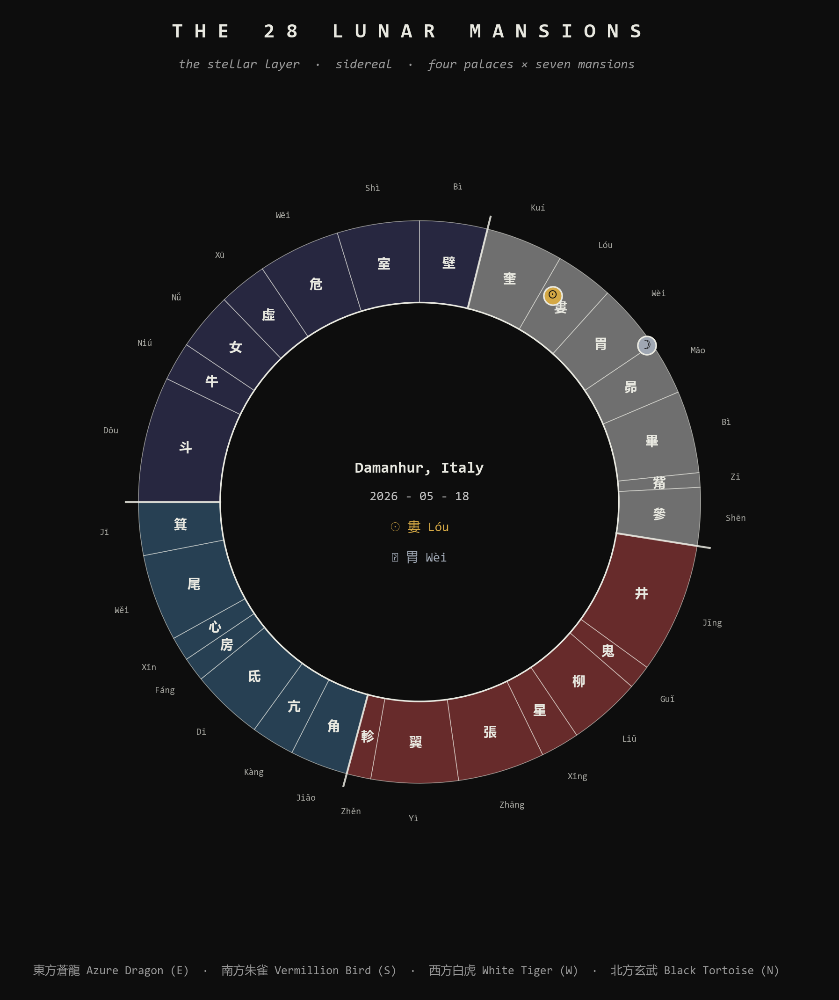
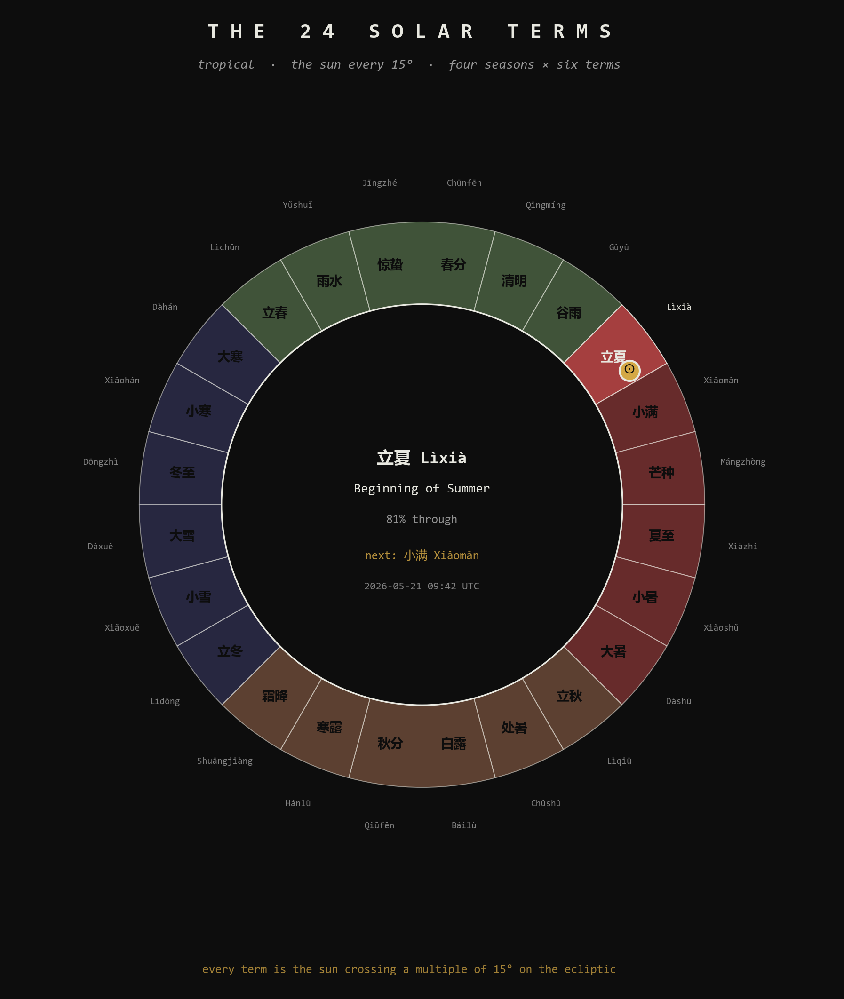
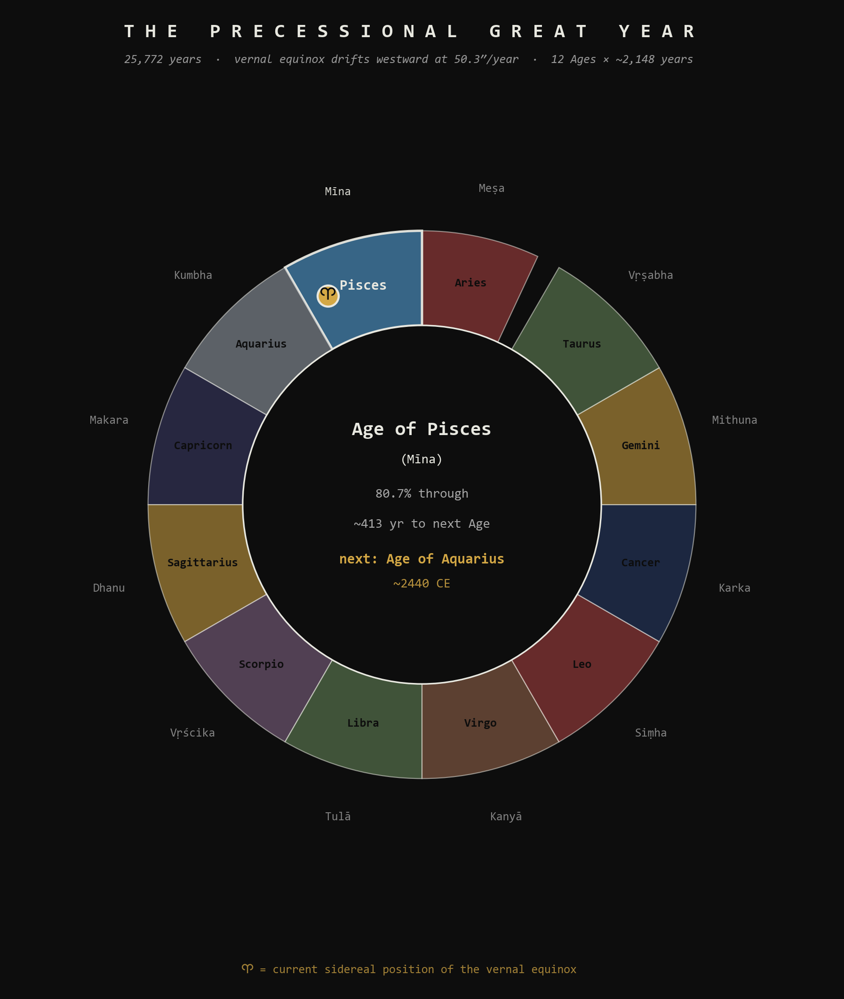
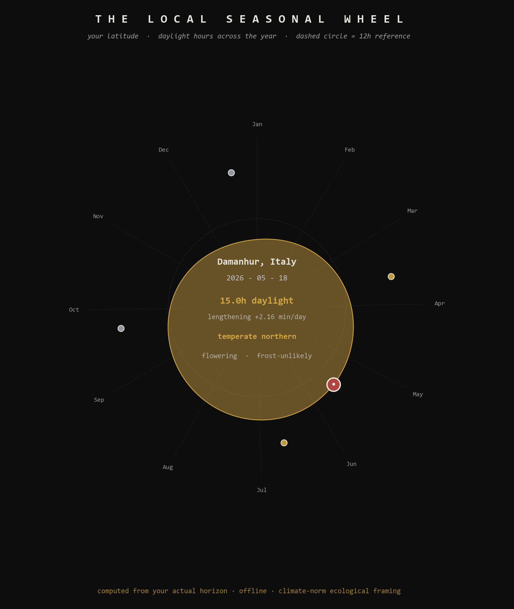

[](astrolabium/tests/)
[](astrolabium/pyproject.toml)
[](LICENSE)
[](https://github.com/tasumermaf)

# Meridian — the Astrolabium harness

> *What is the alchemical quality of this moment?*

A working temporal navigation instrument plus the research intelligence
that runs it. Sixteen temporal and ecological systems synthesized into
one readable display — integrated, regression-tested, and configured
with all the context needed to explain itself to anyone who asks.
Fully offline by design.

This is the public **Claude Code harness** for the **Astrolabium Caudae
Rubrae** (*L'Astrolabio Coda Rossa*, the Red Tail Astrolabe).

## The numbers

| Component                                       | Count |
|-------------------------------------------------|-------|
| Rhombic dodecahedron faces                      | 12    |
| Trigram laws (6 cyclic + 2 solar keys)          | 6 + 2 |
| Extraordinary vessels (LGBF)                    | 8     |
| Divine hours (4 day, 4 night)                   | 8     |
| Divine months (12 regular + 1 intercalary)      | 13    |
| Great rites                                     | 6     |
| Earthly branches (organ-clock windows)          | 12    |
| **Lunar mansions (28宿, sidereal)**             | **28** |
| **Solar terms (24节气, tropical)**              | **24** |
| **Cross-tradition sacred festivals**            | **30+** |
| **Named stars (heliacal-rising catalog)**       | **22** |
| **Zodiacal Ages (precessional Great Year)**     | **12** |
| **Great Year period (axial precession)**        | **25,772 yr** |
| **Lunar standstill cycle**                      | **18.6 yr** |
| **Kali Yuga remaining (Vedic deep-time)**       | **~426,872 yr** |
| **Climate zones (Köppen-proxy bands)**          | **5** |
| **Twilight bands (civil / nautical / astronomical)** | **3** |
| Engine tests passing                            | **748** |

The geometry is the argument. Every count above lands on a rhombic
dodecahedron face count, an LGBF vessel count, the unequal-hour
division of solar position, the four-palace × seven-mansion division
of the celestial sphere, or the 15° solar-term step around the
ecliptic. See `docs/specs/` for the full Operator's Manual,
Guidebook, and Periodic Table.

## What the instrument answers

One question: **what is the alchemical quality of this moment?**

That breaks operationally into: which Primeval Law is active in the
**Soul body** right now (lunar phase), which Extraordinary Vessel is
open in the **Astral body** right now (Ling Gui Ba Fa), which organ
window is active in the **Gross body** right now (Organ Clock), which
Divine Hour we're in, whether a Solar Key is cusping, which Divine
Month this is, **which of the 28 lunar mansions the Sun and Moon
currently occupy, which of the 24 solar terms is active, which
sacred festivals are near, which Tibetan lunar month we're in**, and
whether any of those layers happen to be saying the same thing at
the same time (compound detection).

It does not warn, prohibit, or prescribe. It does not tell you a moment
is good or bad. The practitioner is assumed competent. The instrument
displays what is available.


## The non-negotiable constraint

**Every hourly function requires location.** Latitude, longitude, and
timezone. There is **no civil clock** anywhere in this system.

Two practitioners in the same Gregorian time zone but at different
latitudes get different Astrolabium readings, because their solar
horizons differ. This is correct and load-bearing. The instrument reads
from your actual sunrise and sunset, not from Greenwich. Without
location, no reading is possible.

When you talk to the resident Meridian intelligence in this harness, it
will ask for your coordinates if you have not provided them. This is
not pedantry; it is the system.


> *The image above shows the Divine Hours wheel for Damanhur, Italy
> on the spring equinox (2026-03-20), computed live from the project's
> own solar engine — 182 minute day hour, 177 minute night hour.
> Eat your own cooking.*

## The 6+2 architecture

Three independent traditions converge on the same split: the *Cantong
qi* (Daoist alchemy) excludes Kǎn ☵ and Lí ☲ from the lunar cycle and
treats them as the alchemical operators; the **Plum Blossom Fist Form**
avoids the Water positions when traversing the Posterior Heaven Bagua;
the *Book of Three Responses* identifies Water as the medium of the
mirror-transit, not a phase of it.

Six trigrams carry six cyclic **Primeval Laws** through the lunar
month. Two trigrams sit outside the cycle as **Solar Keys**, activating
at sunrise (Gold Key, Kǎn ☵, Fall of Events) and sunset (Silver Key, Lí
☲, Divinity). The two cusps are the daily moments when the alchemical
fire is most precisely controllable.


## The Stellar Layer

The original Astrolabium had four temporal bodies: Soul, Solar Keys,
Astral, Gross. In May 2026 a **fifth body** was added in response to
two source documents: Xue Mei's white paper *Living Time Keepers*
(Section VI named the Stellar Layer as the missing piece) and her
*Saga Dawa — Awakening the Root of the Dragon*, which provided the
exact stellar system to build — the **Chinese 28 Lunar Mansions**
(二十八宿) with the Root Mansion (氐 Dī) as the foundation of the
Tibetan Buddhist Saga Dawa month.

The Stellar Layer integrates four sub-systems:

- **28 Lunar Mansions (sidereal)** — where the Sun, Moon, and visible
  planets sit in the four palaces (Azure Dragon East, Black Tortoise
  North, White Tiger West, Vermillion Bird South). Sidereal positions
  via Lahiri ayanamsa to align modern astronomical computation with
  the classical Han-era mansion boundaries.
- **24 Solar Terms (tropical)** — the canonical Chinese seasonal
  markers at every 15° of the Sun's ecliptic longitude. The four
  cardinal terms (equinoxes and solstices) align with four of the
  six Damanhurian Great Rites.
- **Cross-tradition Sacred Festival Registry** — 30+ festivals across
  Tibetan Buddhist, Hindu, Chinese, Christian, Celtic, Islamic, Jewish,
  Mexican, Persian, Theravada, and Damanhurian traditions, each
  resolved by its proper anchor (solar date, solar term, lunar month +
  day, Tibetan lunar month, or computed luni-solar rule).
- **Tibetan Buddhist Calendar (Phugpa)** — Tibetan lunar month
  tracking with Saga Dawa as the Buddha-month, tied directly to the
  Root Mansion via the dragon-root regeneration thesis.





> *Both wheels above are computed live for Damanhur, May 18 2026, by
> the project's own engine. The Sun sits in 婁 Lóu (Bond, mansion 15)
> sidereally, the Moon in 胃 Wèi (Stomach, mansion 16). The current
> solar term is 立夏 Lìxià (Beginning of Summer), 81% complete; the
> next term Xiǎomǎn arrives at 09:42 UTC on May 21. We are in Tibetan
> Month 4 — Saga Dawa — the Buddha-month, where the dragon root
> awakens. Eat your own cooking.*

## The Deep Sky Layer

Sprint A added the Stellar Layer (mansions, terms, festivals, Tibetan
month). Sprint B extends the architecture into its full sky-deep
reach with four further sub-systems:

- **Axial precession** — the 25,772-year Great Year of Plato. We are
  currently in the **Age of Pisces (Mīna)**, ~80% through, with about
  **413 years remaining** before the equinox crosses into the **Age of
  Aquarius (Kumbha)** around **2440 CE**. Polaris is the closest pole
  star (closest approach ~2100 CE); Vega will be the pole star around
  14,000 CE.
- **Heliacal risings** — a catalog of 22 culturally-significant named
  stars (Sirius/Sopdet, the Pleiades/Mǎo, Spica/Citrā, Antares,
  Aldebaran, Vega/Zhīnǚ, Altair/Niúláng, and many more) with their
  next first-dawn appearances at the practitioner's location. The
  canonical anchor: **Sirius rises heliacally at Memphis, Egypt on
  August 4, 2026** — the Sothic-cycle marker the pharaohs used to
  predict the Nile flood.
- **Major lunar standstills** — the 18.6-year nodal cycle. We are
  ~6% past the **March 2025 major standstill peak**; the next major
  is around **November 2043**, the next minor June 2034. This is the
  cycle that Stonehenge, Callanish, and Chimney Rock were built to mark.
- **Vedic yuga / kalpa deep-time** — the cosmological frame that
  situates ordinary historical time within the Sanskrit tradition's
  nested cycles. We are in the **Kali Yuga (~5,127 years in, 1.187%
  complete)**, **28th Mahā Yuga** of the **7th Manvantara**
  (Vaivasvata Manu), **45.67% through the Shvetavārāha Kalpa** —
  the current Day of Brahmā.



> *The precession wheel above is computed live for May 18, 2026 by
> the project's own engine. The 12 zodiacal Ages run around the wheel
> with their Sanskrit names; the Aries glyph (♈) marks the current
> sidereal position of the vernal equinox in late Pisces. The center
> shows the live state: Age of Pisces, 80.7% through, ~413 years to
> the Age of Aquarius (~2440 CE).*

## The Ecological Layer

Sprint C adds a **sixth body** to the Astrolabium — the Ecological
Layer — derived entirely from astronomy + latitude bands, offline,
no live weather data. The design choice was deliberate: live weather
integration would have been the first violation of the project's
offline-first ethos. Climate-norm honesty was the better fit.

The Ecological Layer gives the practitioner:

- **Photoperiod state** — daylight hours, night hours, the three
  twilight bands (civil / nautical / astronomical, in minutes), the
  signed rate of daylight gain or loss (min/day), the seasonal arc
  (hemisphere-aware: October in Sydney is spring, in Damanhur is
  autumn).
- **Climate zone** — Köppen-derived latitude bands (tropical /
  subtropical / temperate / boreal / polar) with hemisphere flag.
- **Frost risk** — climate-norm classification of "are we in the
  frost season here?" by zone × month. Tropics: never. Temperate:
  hemisphere-flipped Oct-Apr / Apr-Oct windows.
- **Vegetation phenology** — temperate cycle: dormant → awakening →
  leafing → flowering → fruiting → ripening → senescing. Southern
  hemisphere flipped. Tropical "continuous" exception.
- **Growing-degree-day intensity** — none / low / moderate / high,
  by zone × month. A coarse proxy without actual temperature data.



> *The seasonal wheel above plots daylight hours across the full year
> at Damanhur (45.42°N), computed live by the photoperiod engine. The
> gold polygon bulges outward toward the June solstice and contracts
> toward December. Four cardinal markers sit at the equinoxes and
> solstices. The red dot is today — 15.0h daylight, lengthening at
> +2.16 min/day, temperate northern spring, vegetation flowering,
> frost-unlikely.*

**Honest about scope:** the Ecological Layer is a **climate-norm
approximation**, not weather data. It tells you whether you're in the
climate-norm frost season at your latitude; it does not tell you a
heat wave is coming. Live-weather integration (Open-Meteo / NOAA /
MODIS) is reserved for a hypothetical Sprint D, where the offline-
first constraint would be relaxed only for an explicitly opt-in
network layer.

## Quick start

```bash
git clone https://github.com/tasumermaf/meridian.git
cd meridian/astrolabium
pip install -r requirements.txt
pytest                       # 748 passing
```

Run the API:

```bash
cd astrolabium
uvicorn src.api.main:app --reload
```

Compute a reading from Python directly:

```python
from datetime import datetime
import pytz
from astrolabium import calculate_complete_state

dt = pytz.timezone("Europe/Rome").localize(datetime(2026, 5, 16, 22, 47))
state = calculate_complete_state(dt, lat=45.42, lon=7.78, tz="Europe/Rome")

print(state["divine_hour"]["roman"])       # 'V'  (Hour V, second wing)
print(state["organ_clock"]["organ"])       # 'Pericardium'
print(state["organ_clock"]["element"])     # 'Fire'
print(state["derivative"]["vessel"])       # 'Yin Qiao Mai'
print(state["derivative"]["law"])          # 'Fall of Events'
print(state["calendar"]["month_name"])     # 'SAMMA'
print(state["calendar"]["divine_year"])    # 78
```

Or — **and this is the point of bundling Meridian** — launch
[Claude Code](https://claude.com/claude-code) in the cloned repo:

```bash
cd meridian
claude
```

The `CLAUDE.md` and `.claude/rules/` are pre-configured. Meridian
loads automatically. Tell it your location, ask it anything about the
instrument, and it will read the engine, cite the sources, and walk you
through any layer with full context.

## What the harness includes

```
meridian/
├── README.md                        # this file
├── LICENSE                          # MPL-2.0
├── CLAUDE.md                        # Astrolabium-scoped Meridian identity
├── .claude/rules/                   # 23 dense domain rules files
│   ├── astrolabium-core.md          # sixteen integrated systems, vocabulary, constraints
│   ├── temporal-bodies.md           # Stellar / Ecological / Soul / Solar Keys / Astral / Gross
│   ├── stellar-layer.md             # overview of the Stellar + Deep Sky layers
│   ├── divine-hours.md              # 8-fold unequal hour system, Book of Three Responses origin
│   ├── ling-gui-ba-fa.md            # LGBF formula, 8 vessels, stem-branch tables
│   ├── trigram-laws.md              # 6+2 Cantong qi architecture, three-tradition convergence
│   ├── divine-calendar.md           # 13 months, 6 Great Rites, Sephirotic Week, intercalation
│   ├── plum-blossom-alchemy.md      # EV → meridian → Wu Xing elemental bridge
│   ├── tappetino-proof.md           # the geometric-context thesis (identity in the parent environment)
│   ├── names-of-power.md            # Tier 0 character of all 13 month names
│   ├── 28-lunar-mansions.md         # Chinese 28-mansion sidereal stellar system (Sprint A)
│   ├── 24-solar-terms.md            # Chinese tropical seasonal markers (Sprint A)
│   ├── sacred-festivals.md          # 30+ festivals across 10+ traditions (Sprint A)
│   ├── tibetan-buddhist-calendar.md # Phugpa Tibetan calendar, Saga Dawa as Buddha-month (Sprint A)
│   ├── axial-precession.md          # Sprint B — 25,772-yr Great Year, 12 Ages, pole stars
│   ├── heliacal-risings.md          # Sprint B — 22 named stars, Sothic cycle, agricultural markers
│   ├── lunar-standstills.md         # Sprint B — 18.6-yr nodal cycle, megalithic alignments
│   ├── vedic-yuga.md                # Sprint B — Sanskrit deep-time, Kalpa/Manvantara/Yuga
│   ├── photoperiod.md               # NEW (Sprint C) — daylight, twilight, seasonal arc
│   ├── ecological-markers.md        # NEW (Sprint C) — climate-norm derived state
│   ├── location-and-time.md         # the non-negotiable constraint, in full
│   ├── communication-style.md       # voice, epistemic charter, source-tagging
│   └── how-to-use-this-instrument.md  # practical user guidance
├── astrolabium/                     # the working engine
│   ├── src/
│   │   ├── astrolabium.py           # orchestrator: calculate_complete_state(dt, lat, lon, tz)
│   │   ├── engine/                  # solar, lunar, stem_branch, twilight, calendar
│   │   │                            # + stellar, solar_terms, festivals (Stellar Layer)
│   │   │                            # + precession, heliacal, lunar_standstills, vedic_yuga (Deep Sky)
│   │   │                            # + photoperiod, ecological_markers (Ecological Layer)
│   │   ├── api/main.py              # FastAPI backend
│   │   ├── registry.py              # typed lookups into registers.json
│   │   ├── meta_registry.py         # registry validation
│   │   ├── frequency.py             # time-series + windowing
│   │   ├── resonance.py             # compound detection
│   │   └── presentation.py          # state rendering
│   ├── tests/                       # 748 passing
│   ├── data/                        # registers.json, lunar_mansions.json,
│   │                                # solar_terms.json, sacred_festivals.json,
│   │                                # named_stars.json
│   ├── frontend/                    # web UI (vanilla JS + components)
│   ├── scripts/                     # CLI helpers
│   ├── requirements.txt
│   └── pyproject.toml
├── docs/
│   ├── specs/                       # Operator's Manual, Guidebook, Periodic Table, trigram-law spec
│   └── sources/                     # primary source extracts (BTR Ch.4, Cantong qi, TCM EV database, etc.)
├── assets/                          # banner.png + 7 generated diagrams (incl. seasonal wheel)
└── scripts/
    └── generate_assets.py           # regenerates all visual assets from the engine
```

## Eat your own cooking

The eight images in this README are not stock art and not AI-generated.
They are produced by `scripts/generate_assets.py` from the project's
own code, palette derived from the prime-law correspondence, RD geometry
computed from first principles, the Divine Hours wheel computed live
from the engine for an actual location and date, the 28-mansion wheel
and the 24-solar-term wheel computed live from the stellar engine for
the present moment in Damanhur. Regenerate any time:

```bash
python scripts/generate_assets.py
```

This is the TASUMER MAF principle: **the way you build a tool should
embody the tool's thesis**. The Astrolabium's thesis is that twelve-fold
temporal structure follows the rhombic dodecahedron's geometry; the
banner depicts that. The thesis is that hours derive from the
practitioner's actual horizon; the Divine Hours wheel computes that
for Damanhur on the equinox and shows the numbers. The thesis is that
three traditions converge on the 6+2 split; the lunar-architecture
diagram lays out the convergence visually.

## What the instrument is NOT

- Not natal astrology (location- and moment-specific, not birth-chart-specific)
- Not a calendar replacement (overlays the Gregorian civil scaffold)
- Not a personality system
- Not medical advice (TCM organ-clock readings are correspondences, not diagnoses)
- Not deterministic in the practitioner's response

## Provenance and epistemic charter

Every claim the instrument or Meridian makes carries one of these
markers:

| Tag                          | Meaning |
|------------------------------|---------|
| `[VERIFIED]`                  | computed, tested, in the code/data |
| `[SOURCE: Damanhurian]`       | from Damanhurian sources (BTR, Primeval Laws text, dictionary) |
| `[SOURCE: TCM]`               | from canonical TCM (Cantong qi, Nèi Jīng, LGBF transmission) |
| `[MATHEMATICAL FACT]`         | deterministic output of a stated procedure |
| `[ANALYTICAL CONTRIBUTION]`   | synthesis beyond what any single source establishes |
| `[UNKNOWN]`                   | not addressed in the available material |

The integration of the six systems into one instrument, the Plum
Blossom Alchemy bridge from Extraordinary Vessels to Wu Xing elements,
the prime-law correspondence palette, the Two-Body Unity formalism,
and the Tappetino Proof's geometric reading are all
[ANALYTICAL CONTRIBUTION]. The underlying systems (LGBF, the Cantong qi
trigram-Law correspondence, the unequal-hour system, the Damanhurian
calendar) are [SOURCE]-attested. Honesty about the boundary between
what tradition gives and what synthesis adds is the instrument's
authority.

## TASUMER MAF

This repository is part of **TASUMER MAF** — the cybernetics-consulting
practice and research program of [Promptcrafted LLC](https://promptcrafted.com).

The name **TASUMER MAF** is a Sacred Language compound whose isopsephic
value is **1093 = κυβερνήτης** (*kybernetes*) — the Greek word from
which *cybernetics* takes its name. The steersman. The one who
navigates by feedback.

**Examine every default. Eat your own cooking. Build circuits, not
decorations. The geometry is the argument.**

Related repositories in the TASUMER MAF org:

- [`rhombic`](https://github.com/tasumermaf/rhombic) — lattice topology
  benchmarking library (cubic vs FCC / rhombic dodecahedron)
- (other repos as they ship)

## License

MPL-2.0. The methodology is open. The instrument is open. The community
serves the practitioner; the practitioner does not serve the community.

## Acknowledgments

The Astrolabium synthesizes work from many traditions and many people.
**Damanhurian sources** — Falco Tarassaco (Oberto Airaudi), the
*Book of Three Responses*, the *Eight Primeval Laws*, the Sacred
Language dictionary. **Traditional Chinese Medicine** — the *Huáng Dì
Nèi Jīng*, the *Zhēn Jiǔ Dà Chéng*, the Ling Gui Ba Fa transmission
lineage, Mantak Chia's Neidan work, the Wu Mei Kung Fu / Plum Blossom
transmission via Sifu Ken Lo. **Hellenistic** — the Cantong qi via
classical Daoist alchemy, the Chaldean planetary weekday derivation.
**Western Mystery tradition** — the Sephirotic Tree of Life as
Hellenistic-to-Renaissance synthesis.

Built and maintained by **Timothy Paul Bielec** with **Meridian** as
configured research intelligence.

*BAV — intimate, to go inside.*
